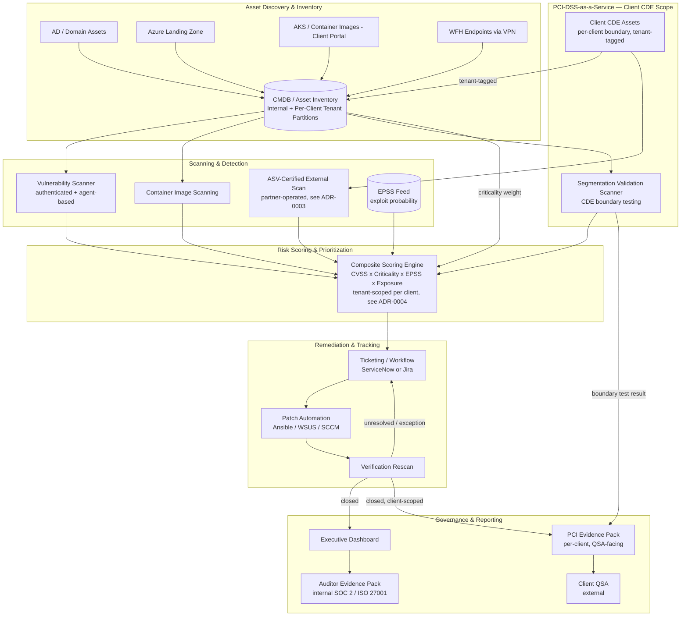
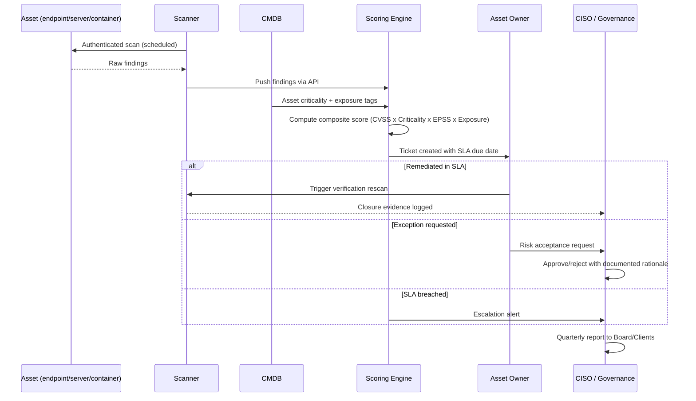

# Vulnerability Management Program — Architecture & Process

**Organization:** Sreelaxmi Global Services
**Layer mapping:** SABSA Logical (process/information flow) & Physical (mechanisms)

---

## 1. Logical Layer — Program Architecture

This shows the components required and how information flows between them — technology-agnostic, so it survives a future tool swap (per the layering discipline established in [ADR-0001](adr/ADR-0001-composite-risk-prioritization-model.md)/[ADR-0002](adr/ADR-0002-scanner-selection-tenable-nessus.md)).

> **Updated 2026-08-23 — PCI-DSS-as-a-Service pivot:** the diagram below now shows per-client tenancy boundaries in the CMDB and Composite Scoring Engine, and a new Segmentation Validation Scanner feeding client CDE boundary evidence into the same pipeline. The original internal-compliance flow (AD/Azure/AKS/VPN → CMDB → Scanner → Engine → Ticket → Patch → Verify → Dashboard → Audit) is unchanged; the PCI additions are new nodes and edges layered on top of it, not a replacement.

**Key architectural decision embedded here:** the Composite Scoring Engine is a distinct component from the scanner — deliberately, so scanner choice ([ADR-0002](adr/ADR-0002-scanner-selection-tenable-nessus.md)) never dictates the prioritization logic ([ADR-0001](adr/ADR-0001-composite-risk-prioritization-model.md)). This is the Physical-vs-Logical separation SABSA insists on.

**PCI additions (2026-08-23):** the same separation discipline extends to the multi-tenant and ASV additions — the Segmentation Validation Scanner and ASV-certified external scan are new *inputs* to the existing Composite Scoring Engine, not a parallel scoring path, so a client's PCI findings are prioritized with the same risk model as everything else. Tenancy isolation (CMDB partitioning, tenant-scoped engine execution) is a Physical-layer concern addressed in [ADR-0004](adr/ADR-0004-multi-tenant-data-isolation-model.md); ASV sourcing is addressed in [ADR-0003](adr/ADR-0003-external-asv-scanning-approach.md).

---

## 2. Vulnerability Lifecycle — Process Flow

*(Unchanged by the PCI-DSS-as-a-Service pivot — the internal-compliance lifecycle above is preserved as-is. A client-facing PCI variant of this flow, ending in QSA-facing evidence rather than Board reporting, is implied by the Report-layer additions in §1 but not separately diagrammed here.)*

---

## 3. Physical Layer — Component Choices for Sreelaxmi

| Logical Component | Physical Implementation (proposed) |
|---|---|
| Asset Discovery / CMDB | Lightweight CMDB (e.g., Device42 or a scoped ServiceNow CMDB module) bootstrapped from AD + Azure Resource Graph + manual delivery-center reconciliation |
| Scanner | Tenable Nessus (see [ADR-0002](adr/ADR-0002-scanner-selection-tenable-nessus.md)) — authenticated agent + agentless scanning |
| Container Image Scanning | Trivy or Nessus's container plugin integrated into the AKS CI/CD pipeline |
| EPSS Feed | FIRST.org EPSS API (free, public) |
| Scoring Engine | Custom Python service (build, not buy — per [ADR-0001](adr/ADR-0001-composite-risk-prioritization-model.md) rationale), consuming scanner + EPSS + CMDB APIs |
| Ticketing | Existing ITSM tool if Sreelaxmi has one; else lightweight Jira Service Management instance |
| Patch Automation | Ansible for Linux/servers, WSUS/SCCM (or Intune, if licensed) for Windows desktop fleet |
| Dashboard/Reporting | Grafana or the ticketing tool's native reporting, feeding a monthly PDF pack for auditors |
| ASV-Certified External Scanning *(new — PCI-DSS-as-a-Service)* | Partner ASV, orchestrated by Sreelaxmi's platform rather than operated in-house — see [ADR-0003](adr/ADR-0003-external-asv-scanning-approach.md) |
| Multi-Tenant CMDB / Scoring Engine Isolation *(new — PCI-DSS-as-a-Service)* | Separate database per client, shared application/compute layer — see [ADR-0004](adr/ADR-0004-multi-tenant-data-isolation-model.md) |

## 4. RACI

| Activity | CISO | Security Architect | IT Infra | Delivery Center Ops | Asset Owner |
|---|---|---|---|---|---|
| Define scoring model / policy | A | R | C | C | I |
| Select tooling | A | R | C | I | I |
| Run scans | I | C | R | I | I |
| Remediate findings | I | I | C | C | R |
| Approve risk exceptions | A/R | C | I | C | I |
| Auditor reporting | A | R | I | I | I |

*(A = Accountable, R = Responsible, C = Consulted, I = Informed)*

### 4.1 PCI-DSS-as-a-Service Additions (Added 2026-08-23)

New client-facing activities introduced by the PCI-DSS-as-a-Service pivot, with a new **PCI Program Lead** role covering QSA/client-facing reporting — added as a column rather than folded into the existing roles above, since the internal RACI's "Auditor reporting" row is scoped to Sreelaxmi's own SOC 2 / ISO 27001 auditors, not a client's QSA.

| Activity | CISO | Security Architect | IT Infra | PCI Program Lead (Client-Facing) | Client QSA (external) |
|---|---|---|---|---|---|
| Manage ASV partner relationship | A | R | I | R | I |
| Run/coordinate segmentation validation scans | A | C | R | R | I |
| Compile PCI evidence pack per client | I | C | I | A/R | I |
| Deliver evidence pack to client QSA | I | I | I | A/R | I |
| Respond to QSA follow-up / evidence queries | I | C | I | A/R | C |
| Approve client-facing risk exceptions (CDE-scoped) | A/R | C | I | C | I |

*(A = Accountable, R = Responsible, C = Consulted, I = Informed. The Client QSA is external to Sreelaxmi and is never Accountable or Responsible for Sreelaxmi-side activities — included here to make explicit which activities require QSA touchpoints.)*
