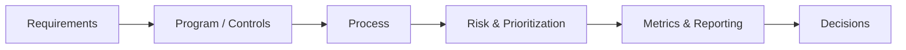

# Cybersecurity Architecture Lab

**Application, Cloud & Enterprise Security Architecture**

This lab documents cybersecurity architecture as deliberate practice:
security programs, controls, trade-offs, and the reasoning behind security
decisions — the same engineering discipline applied to
[Solution Architecture Lab](https://chanduazad001.github.io/solution-architecture-lab/),
scoped to security.

The goal is the same: **not just to list controls, but to understand why a
program is designed the way it is, how it scales, how it fails, and how it
is operated.**

---

## Focus Areas

### Cybersecurity Architecture

Security programs, controls, and Architecture Decision Records —
currently the vulnerability management program: discovering,
prioritizing, remediating, and reporting on vulnerabilities across the
estate, its lifecycle, SLAs, and the ADRs behind them.

### Security System Design

The reusable system-design theory behind security architecture
decisions: threat modeling, zero trust, identity and access design, and
the other system-design concerns specific to building security into
systems at scale.

---

## Coming Next

Planned domains, in rough priority order — not yet documented:

* **Application Security** — SAST/DAST/SCA, secure SDLC, dependency and container image scanning
* **Cloud & Infrastructure Security** — landing zone guardrails, CSPM, IAM boundaries
* **Identity & Access Management** — authN/authZ, privileged access, MFA, Zero Trust
* **Threat Modeling** — STRIDE-based reviews integrated into architecture design
* **Detection & Incident Response** — SIEM, alerting, playbooks, tabletop exercises
* **Governance, Risk & Compliance** — policy, control frameworks, audit evidence

---

## How This Lab Works

## Related

* [chanduazad001.github.io](https://chanduazad001.github.io/) — all labs, and more about me
* [Solution Architecture Lab](https://chanduazad001.github.io/solution-architecture-lab/) — cloud architecture, platform engineering, and system design
* [AI Platform Architecture Lab](https://chanduazad001.github.io/ai-platform-architecture-lab/) — AI platform architecture and AI system design

---

*Cybersecurity Architecture Lab — Chandra Sekhar Merugu*
