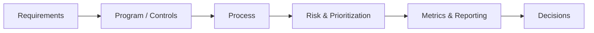

# Cybersecurity Architecture Lab

**Application, Cloud & Enterprise Security Architecture**

This lab documents cybersecurity architecture as deliberate practice:
security programs, controls, trade-offs, and the reasoning behind security
decisions — the same engineering discipline applied to
[Architecture Lab](https://chanduazad001.github.io/architecture-lab/),
scoped to security.

The goal is the same: **not just to list controls, but to understand why a
program is designed the way it is, how it scales, how it fails, and how it
is operated.**

---

## Domains

Each domain lives under its own top-level section, documented with a
consistent set of pages appropriate to that domain — typically an
Overview, the program/process detail, and a Decisions page recording ADRs.

| Domain | Description | Status |
| --------------- | -------------- | -------- |
| [Vulnerability Management](vulnerability-management/index.md) | Discovering, prioritizing, remediating, and reporting on vulnerabilities across the estate — the program lifecycle, SLAs, and the ADRs behind them. | Active |

---

## Coming Next

Planned domains, in rough priority order — not yet documented:

* **Application Security** — SAST/DAST/SCA, secure SDLC, dependency and container image scanning
* **Cloud & Infrastructure Security** — landing zone guardrails, CSPM, IAM boundaries
* **Identity & Access Management** — authN/authZ, privileged access, MFA, Zero Trust
* **Threat Modeling** — STRIDE-based reviews integrated into architecture design
* **Detection & Incident Response** — SIEM, alerting, playbooks, tabletop exercises
* **Governance, Risk & Compliance** — policy, control frameworks, audit evidence

---

## How This Lab Works

## Related

* [Architecture Lab](https://chanduazad001.github.io/architecture-lab/) — cloud architecture, platform engineering, and system design
* [chanduazad001.github.io](https://chanduazad001.github.io/) — all labs

---

*Cybersecurity Architecture Lab — Chandra Sekhar Merugu*
