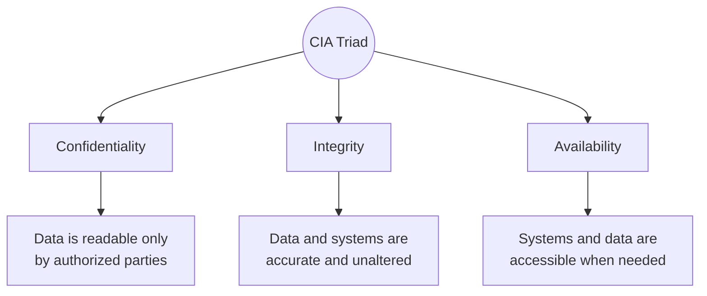

# Security Fundamentals

## 1. Purpose

Every control, pattern, and architecture decision in this lab traces back
to a small set of properties a system is trying to protect. This page
defines those properties and the core principles used to reason about
trade-offs when designing security into a system.

---

## 2. The CIA Triad

| Property | Definition | Fails when | Typical controls |
| --- | --- | --- | --- |
| **Confidentiality** | Information is disclosed only to authorized individuals, processes, or systems | A data breach, leaked credential, or overly broad access grant exposes data to someone who shouldn't see it | Encryption (at rest, in transit), access control, tokenization, data classification |
| **Integrity** | Information and systems are accurate, complete, and unaltered except by authorized action | Data is tampered with, corrupted in transit, or modified by an attacker without detection | Hashing/checksums, digital signatures, version control, audit logging, input validation |
| **Availability** | Authorized users can access information and systems when needed | A DDoS attack, hardware failure, or misconfiguration takes a system offline | Redundancy, failover, capacity planning, rate limiting, backups and DR |

The triad is a set of trade-offs, not a checklist to maximize
independently. Encrypting every field improves confidentiality but can
hurt availability (key management becomes a new failure mode) and
performance; a system that never denies a request maximizes availability
but may sacrifice confidentiality by failing open. Architecture decisions
should state explicitly which property is being prioritized, and why.

---

## 3. Beyond the Triad

The classic triad is necessary but not sufficient. Two related properties
come up constantly in system design and are easy to conflate with the
three above:

| Property | Definition | Distinct from |
| --- | --- | --- |
| **Authenticity** | The claimed identity of a user, system, or piece of data is genuine | Confidentiality — data can be authentic but not secret (a public, signed release note) |
| **Non-repudiation** | An actor cannot credibly deny having performed an action | Integrity — integrity means data wasn't altered; non-repudiation means the *origin* of an action is provable (e.g. via signed audit logs) |

---

## 4. AAA: Authentication, Authorization, Accounting

AAA is the operational framework most identity and access architecture is
built on:

| Stage | Question it answers | Example mechanisms |
| --- | --- | --- |
| **Authentication** | Who are you? | Passwords + MFA, certificates, SSO/OIDC, biometrics |
| **Authorization** | What are you allowed to do? | RBAC, ABAC, policy engines, scoped tokens |
| **Accounting (Auditing)** | What did you actually do? | Audit logs, session recording, SIEM ingestion |

Authentication without authorization only proves identity, not
permission; authorization without accounting means violations may never
be detected after the fact.

---

## 5. Core Design Principles

### Least Privilege
Grant the minimum access required to perform a function, for the minimum
time required — nothing is granted "just in case."

### Defense in Depth
No single control is assumed sufficient. Controls are layered (network,
host, application, data) so that one failure doesn't equal full
compromise.

### Fail Secure (Fail Closed)
When a control fails, it should fail to the more restrictive state (deny
access) rather than the more permissive one (allow access), unless the
system explicitly requires fail-open for safety reasons.

### Separation of Duties
No single individual or component should be able to complete a sensitive
action end-to-end unchecked — e.g. the person who requests a change is
not the person who approves and deploys it.

### Zero Trust
Never trust, always verify — identity and authorization are checked on
every request based on context (identity, device, location, behavior),
regardless of whether the request originates inside or outside a
traditional network perimeter.

### Economy of Mechanism
Simpler designs are easier to verify and have a smaller attack surface;
complexity is the enemy of assurance.

---

## 6. Related

* [Security System Design Overview](index.md)
* [Cybersecurity Architecture](../vulnerability-management/index.md)
