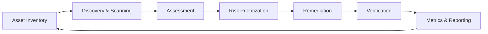

# Cybersecurity Architecture

## Executive Summary

Vulnerability management is the continuous program of discovering,
assessing, prioritizing, remediating, and verifying the closure of
weaknesses across an organization's estate — infrastructure, applications,
cloud resources, and dependencies.

It is treated here as a **program**, not a tool: the platform (scanner,
CSPM, SCA) is only one component. The program also defines ownership,
SLAs, exception handling, and the metrics used to demonstrate the estate is
actually getting safer over time.

---

## Program Lifecycle

The lifecycle is a closed loop rather than a one-time project: reporting
feeds back into inventory and scan-scope decisions, and verification
re-enters the loop as a new scan cycle.

See [Program & Lifecycle](program.md) for the detailed process, RACI, and
cadence.

---

## Scope

This domain covers:

| Area | Covered |
| --- | --- |
| Network & host vulnerabilities | Yes |
| Web application vulnerabilities (DAST) | Yes |
| Container image vulnerabilities | Yes |
| Cloud misconfiguration (CSPM) | Yes |
| Open-source dependency vulnerabilities (SCA) | Yes |
| Secure code review / SAST findings | Cross-referenced from Application Security (planned) |
| Penetration test findings | Cross-referenced, not a replacement for continuous scanning |

Vulnerability management complements, but does not replace, secure SDLC
practices, threat modeling, or penetration testing — those are separate
domains that feed findings into this same remediation and reporting
pipeline.

---

## Key Principles

### Inventory Before Scanning

An asset that is not in inventory cannot be reliably scanned, and
unscanned assets are the most common source of "unknown" exposure.

### Risk-Based, Not Severity-Only

Prioritization should combine severity (CVSS), real-world exploitability
(EPSS, known-exploited status), and business context (asset criticality,
exposure), rather than remediating strictly in CVSS order.

### SLAs Are a Commitment, Not a Target

Once agreed, remediation SLAs should be tracked and reported against
consistently — exceptions are handled through an explicit risk-acceptance
process, not by silently missing the SLA.

### Verify, Don't Assume

A vulnerability is only closed once a rescan or equivalent evidence
confirms remediation — not when a ticket is marked resolved.

### Coverage Is a Metric

Scan coverage (percentage of known assets scanned in the current cycle) is
tracked alongside remediation metrics; a low-vulnerability count on
incomplete coverage is not evidence of a healthy program.

---

## Pages in This Domain

| Page | Description |
| --- | --- |
| [Program & Lifecycle](program.md) | The end-to-end process, ownership (RACI), and scan/report cadence |
| [Discovery & Scanning](discovery-scanning.md) | Asset inventory and the scanning approaches used across the estate |
| [Risk Prioritization](risk-prioritization.md) | How findings are scored and ranked — CVSS, EPSS, KEV, business context |
| [Remediation & SLAs](remediation-slas.md) | SLA tiers, the remediation workflow, and the exception/risk-acceptance process |
| [Metrics & Reporting](metrics-reporting.md) | The KPIs used to report program health, and to whom |
| [Decisions](decisions.md) | ADRs recording the major program design decisions |
| [VM Program Case Study (Meridian)](../00-charter-and-business-case.md) | A fictional BPO/ITES company's SABSA-layered program design, extended with a PCI-DSS-as-a-Service pivot and its own ADRs |
