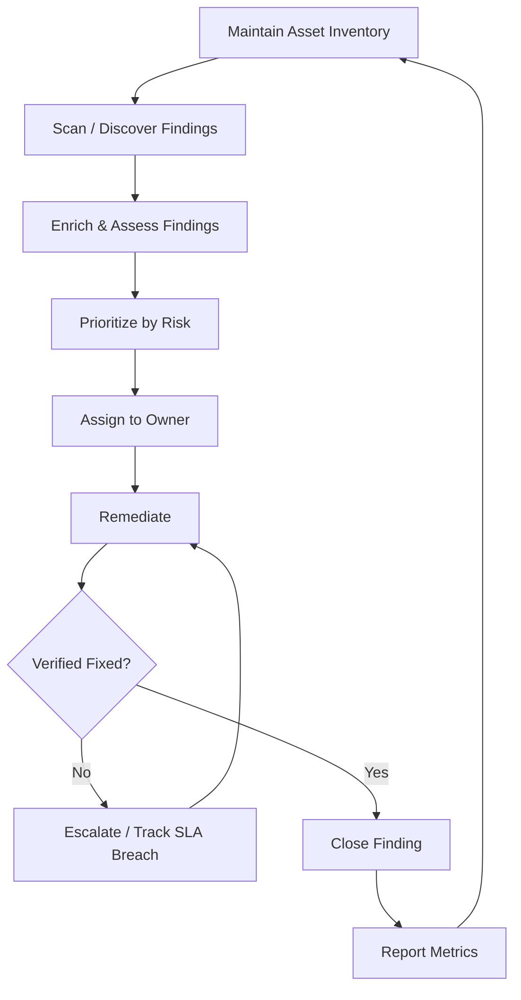

# Program & Lifecycle

## 1. Purpose

This page defines the end-to-end vulnerability management process: the
stages, who owns each stage, and how often each stage runs.

---

## 2. Process Flow



---

## 3. Stage Definitions

| Stage | Description |
| --- | --- |
| Maintain Asset Inventory | Keep an authoritative, continuously updated record of hosts, cloud resources, containers, and applications in scope |
| Scan / Discover Findings | Run scheduled and on-demand scans against the inventory; ingest findings from CSPM, SCA, and pen tests |
| Enrich & Assess Findings | Deduplicate, validate (filter false positives), and attach asset context (owner, environment, criticality) |
| Prioritize by Risk | Score findings using CVSS, EPSS, exploited-in-the-wild status, and asset criticality — see [Risk Prioritization](risk-prioritization.md) |
| Assign to Owner | Route the finding to the accountable team via the existing ticketing system, not a spreadsheet |
| Remediate | Owner patches, reconfigures, or otherwise closes the finding within its SLA — see [Remediation & SLAs](remediation-slas.md) |
| Verify | Rescan or otherwise confirm the finding no longer reproduces before closing |
| Report | Publish metrics to the relevant audience at the agreed cadence — see [Metrics & Reporting](metrics-reporting.md) |

---

## 4. RACI

| Activity | Security Team | Asset/System Owner | Platform/Infra Team | Leadership |
| --- | :---: | :---: | :---: | :---: |
| Maintain scan tooling & inventory sync | A/R | C | C | I |
| Run scans | R | I | I | I |
| Triage & risk-score findings | A/R | C | I | I |
| Remediate finding | C | A/R | R | I |
| Grant risk-acceptance exception | A | R | I | C |
| Verify closure | R | C | C | I |
| Report program metrics | A/R | I | I | C |

**R** = Responsible, **A** = Accountable, **C** = Consulted, **I** = Informed

---

## 5. Cadence

| Activity | Frequency |
| --- | --- |
| Full asset inventory reconciliation | Weekly (automated), monthly (manual review) |
| Authenticated infrastructure scan | Weekly |
| Web application (DAST) scan | Per release, plus scheduled monthly |
| Container image scan | On every build (CI pipeline) |
| Cloud configuration (CSPM) scan | Continuous |
| Dependency (SCA) scan | On every build, plus scheduled weekly |
| Critical/High SLA status review | Weekly |
| Program metrics report to leadership | Monthly |

Critical severity findings with a known exploit or public proof-of-concept
trigger an out-of-band scan and review rather than waiting for the next
scheduled cycle.

---

## 6. Exception Handling

A finding that cannot be remediated within its SLA follows a
risk-acceptance process rather than being left open silently:

```text
Owner requests exception
        |
        v
Compensating control identified (if any)
        |
        v
Security review (risk, exposure, compensating control)
        |
        v
Time-bound approval by Accountable owner
        |
        v
Tracked with an expiry date, re-reviewed at expiry
```

Exceptions are never permanent by default — each one carries an expiry
date and is re-reviewed, not silently renewed.

---

## 7. Related

* [Discovery & Scanning](discovery-scanning.md)
* [Risk Prioritization](risk-prioritization.md)
* [Remediation & SLAs](remediation-slas.md)
* [Metrics & Reporting](metrics-reporting.md)
