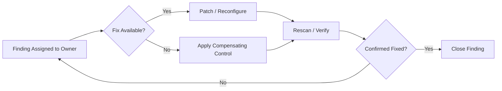

# Remediation & SLAs

## 1. Overview

This page defines the remediation SLA targets by risk tier, the standard
remediation workflow, and how exceptions are handled when a finding cannot
be fixed within its SLA.

---

## 2. SLA Targets

| Risk Tier | Internet-Facing Assets | Internal Assets |
| --- | --- | --- |
| Critical | 7 days (24–48 hours if actively exploited) | 14 days |
| High | 30 days | 30 days |
| Medium | 60 days | 90 days |
| Low | 180 days | Best effort / next maintenance window |

SLA clock starts when the finding is validated (false positives excluded),
not when it is first detected by an unauthenticated scan.

---

## 3. Remediation Workflow

Compensating controls (WAF rule, network ACL, feature flag) are a
temporary bridge, not a substitute for the underlying fix — they still
carry a tracked exception with an expiry date per [Program &
Lifecycle §6](program.md#6-exception-handling).

---

## 4. Escalation

| SLA Status | Action |
| --- | --- |
| Approaching SLA (75% of window elapsed) | Automated reminder to owner and their manager |
| SLA breached, no exception on file | Escalated to leadership in the weekly Critical/High review |
| SLA breached, exception in progress | Tracked separately, not counted as a breach once approved |

---

## 5. Exception / Risk Acceptance

An exception requires:

1. A named business or technical reason the fix cannot land within SLA
2. A compensating control, where one exists
3. Approval from the accountable owner (see [Program & Lifecycle
   §4](program.md#4-raci))
4. An explicit expiry date — exceptions are re-reviewed at expiry, never
   silently renewed

Exceptions are reported alongside open findings in
[Metrics & Reporting](metrics-reporting.md) so accepted risk stays visible
rather than disappearing from the numbers.

---

## 6. Related

* [Risk Prioritization](risk-prioritization.md)
* [Metrics & Reporting](metrics-reporting.md)
* [Decisions](decisions.md) — ADR-002 records the SLA tier decision
